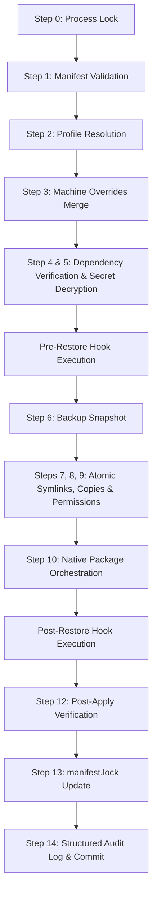

# Revive (`rv`) — AI Agent & Developer Reference Manual

Welcome! This document serves as a comprehensive technical guide for any AI Agent or developer working on, debugging, or extending **Revive (`rv`)**. It details the architecture, module layout, formal state engine, security sandbox model, and standard operational patterns.

---

## 1. System Philosophy & Architecture

Revive is a developer environment lifecycle manager designed for fast, secure, and transactional restores. Its operations are governed by several key principles:

1. **Unidirectional Sync (Primary Flow)**: State normally flows **from repository to system** (`repo → system`). Git commits are the source of truth; `rv restore` applies them locally.
2. **Bidirectional Capability**: `rv backup` provides an optional reverse operation (`system → repo`), capturing live system files and re-encrypting secrets back into the repository. This is the mechanism for capturing dotfile changes made directly on the system before committing.
3. **Strict Transaction Boundaries**: All filesystem changes run inside a 7-step transaction context with complete journal-based rollback support. If *any* step fails (including post-apply package installs or plugin hooks), the system is reverted to its pre-existing state.
4. **Defense-in-Depth Security**: Custom plugins run inside an isolated Python subprocess that restricts imports, blocks unauthorized filesystem paths, intercepts network/sockets, and prevents shell spawns. Secrets are decrypted directly to memory and zeroed out immediately after use.
5. **Platform Neutrality (Unix-First)**: Target platforms are macOS and Linux. Windows support is deferred post-1.0.

---

## 2. Directory Layout & Key Modules

The codebase is organized modularly. Every directory has a highly focused responsibility:

```text
src/rv/
├── __init__.py        # Package entrypoint & version definition
├── __main__.py        # PyInstaller entrypoint
├── cli/
│   ├── __init__.py
│   └── main.py        # Typer CLI application; handles console interaction and formatting
├── gui/
│   ├── __init__.py
│   ├── server.py      # http.server-based Web GUI dashboard (rv gui)
│   └── static/        # HTML/CSS/JS assets for the cosmic-dark dashboard
├── logging/
│   ├── __init__.py
│   └── audit.py       # Dual-logger: structured JSON audit logs + Rich console outputs
├── models/
│   ├── __init__.py
│   ├── manifest.py    # Pydantic v2 validation models for manifest.yaml
│   ├── transaction.py # Pydantic schemas for Transaction Journals and manifest.lock
│   └── workspace.py   # Global workspace registry models (~/.config/rv/workspaces.yaml)
├── plugins/
│   ├── __init__.py
│   ├── context.py     # ReviveContext schema passed to plugins
│   ├── loader.py      # Scan, discover, and validate plugin manifests (plugin.yaml)
│   ├── sandbox.py     # Subprocess coordinator and timeout enforcer
│   ├── sandbox_wrapper.py # Pre-run hook; patches builtins/socket/subprocess inside sandbox
│   └── builtin/       # First-party AI asset plugins (mcp-config, claude-prompts, python-skills)
├── providers/
│   ├── __init__.py    # Provider registry
│   ├── base.py        # BaseProvider with exponential backoff retry executor
│   ├── apt.py         # APT (Debian/Ubuntu) package manager orchestration
│   ├── brew.py        # Homebrew (macOS/Linux) orchestrations via Brewfiles
│   ├── docker.py      # Docker image pull and compose orchestration
│   ├── flatpak.py     # Flatpak package orchestration
│   ├── node.py        # Node.js environments (nvm/fnm detection and .nvmrc matching)
│   └── snap.py        # Snap package manager orchestration
├── security/
│   ├── __init__.py
│   ├── encryptor.py   # Age cryptographic engine (pyrage + age CLI fallback)
│   ├── permissions.py # POSIX permission validator & enforcer (os.chmod wrapper)
│   ├── scrubber.py    # Log/trace regex-based credential and secret scrubbers
│   ├── tempfile.py    # Secure temp files created with 0600 permissions
│   └── zerobuffer.py  # In-memory buffer clearing (explicit memory wiping)
├── services/
│   ├── __init__.py
│   ├── backup.py      # BackupService: system → repo sync (rv backup)
│   ├── doctor.py      # System diagnostic engine (rv doctor)
│   ├── handlers.py    # Asset type executors (Copy, Symlink, Template, Secret)
│   ├── recovery.py    # Transaction recovery and journal replay engine
│   ├── restore.py     # 14-step unidirectional apply coordinator + ManifestLoader + ProfileResolver
│   ├── status.py      # Drift analysis & colored diff generation
│   └── workspace.py   # Workspace discovery and registration service
├── transactions/
│   ├── __init__.py
│   ├── atomic.py      # Atomic temp-write + rename helper (prevents partial writes)
│   ├── context.py     # 7-step transactional executor with rollback
│   └── lock.py        # Flock-based process serialization lock (~/.config/rv/rv.lock)
├── utils/
│   ├── __init__.py
│   ├── interpolate.py # Environment variable interpolation (${VAR:-default})
│   ├── path.py        # Canonicalization, path traversal checks, symlink loop checks
│   └── platform.py    # Distro and OS detection
└── watchers/
    ├── __init__.py
    └── daemon.py      # Watchdog daemon for auto-applying changes on repository updates
```

---

## 3. Formal State Model & Lifecycle

To ensure system integrity, Revive enforces strict state models for execution and transitions.

### 3.1 Unidirectional Synchronization Invariant
$$\text{Desired State} \equiv \text{Repository State} \equiv \text{Local System State}$$

### 3.2 The 14-Step Restore Process
All restore operations (`rv restore <profile>`) execute in this precise order:



### 3.3 The 7-Step Transactional Lifecycle
Inside `TransactionContext`, file updates are mapped onto this cycle:
1. **Plan**: Compute mutations and map source-to-target paths.
2. **Validate**: Perform pre-flight permission, storage, and parent-directory availability checks.
3. **Snapshot**: Back up existing files/symlinks/directories (recursively via `shutil.copytree`) to `~/.config/rv/backups/<tx_id>` and save the transaction journal.
4. **Execute**: Mutate the system atomically (write to temp file, chmod, and atomic rename; for directories, executes recursive copytree atomically using temporary sibling folders).
5. **Verify**: Run checksum and POSIX permission comparisons to guarantee success.
6. **Commit**: Mark journal as `committed` and update `manifest.lock`.
7. **Cleanup**: Wipe backup snapshots and active journals.

### 3.4 Target Arrays & Recursive Directories
Revive natively supports managing complex folder hierarchies and multi-destination workflows under a single asset ID:
*   **Target Arrays (`target: str | list[str]`)**: Both `Asset` and `Secret` models accept single-string target paths or lists of target paths. The orchestration system automatically interpolates environment variables and processes all targets in the list safely.
*   **Recursive Directory Synchronization**: When a source is a directory, the `copy` handler performs atomic directory copying and transactional tracking (including full recursive snapshot backup and directory rollback).
*   **Automated Sub-Item Resolution**: If the source path is a directory and the target is a list, Revive automatically matches each target path's basename with the corresponding file/folder in the source directory, copying only that specific sub-item to its target destination.

---

## 4. Plugin Security Sandbox

Revive plugins are highly sandboxed. They are executed via a custom wrapper:
`python -m rv.plugins.sandbox_wrapper <entrypoint> <perms_b64> <context_b64> <hook_type>`

The `sandbox_wrapper` patches critical builtins and libraries in-memory:
*   **Filesystem Restrictions**: Overrides `builtins.open` and critical `os` operations (`os.remove`, `os.unlink`, `os.mkdir`, etc.). Filesystem access is strictly gated to the plugin source folder, the repository root, the system temp directory, and transaction targets.
*   **Network Restriction**: If `permissions.network` is `false`, `socket.socket` is patched to raise `PermissionError`.
*   **Shell Restriction**: If `permissions.shell` is `false`, `subprocess.Popen`, `subprocess.run`, `os.system`, `os.popen`, and `os.spawn*` are patched to raise `PermissionError`.
*   **Execution Timeouts**: Subprocesses are governed by a mandatory timeout (default `30` seconds, configurable up to `300` seconds).

---

## 5. Standard Extension Patterns

Follow these template structures to extend the capabilities of Revive.

### 5.1 Adding a New Package Provider
All providers inherit from `BaseProvider` inside `src/rv/providers/base.py`.

```python
# src/rv/providers/my_manager.py
from typing import Any
from rv.providers.base import BaseProvider, ProviderError

class MyManagerProvider(BaseProvider):
    """Orchestrates package installations for MyManager."""

    def __init__(self) -> None:
        super().__init__("mymanager")

    def install(self, packages: list[str], dry_run: bool = False) -> None:
        """Installs the packages. Retries on transient errors."""
        if not packages:
            return

        if not self.is_available():
            raise ProviderError("mymanager command-line tool is not installed on this system.")

        if dry_run:
            logger.info(f"[Dry Run] Would install MyManager packages: {', '.join(packages)}")
            return

        # Pre-verify package presence or rely on native package manager checks
        # Execute commands using the robust `execute_with_retry` method
        cmd = [self.name, "install", "-y"] + packages
        try:
            self.execute_with_retry(cmd)
        except Exception as e:
            raise ProviderError(f"MyManager installation failed: {e}") from e
```

Then, register the new provider in the `RestoreService.restore` flow inside `src/rv/services/restore.py` and the `DoctorService` inside `src/rv/services/doctor.py`.

### 5.3 Extending BackupService

`BackupService` in `src/rv/services/backup.py` handles the `system → repo` direction. Unlike `RestoreService`, it does **not** use `TransactionContext` — it writes directly to the repository with `shutil.copy2` / `shutil.copytree` and delegates encryption to `AgeEncryptor`.

Key extension points:
- **`_backup_item()`** — processes a single `Asset | Secret`. Add new logic here for new asset types that need custom back-copy behavior.
- **`resolve_identity()`** — controls how the age identity file is located. The default path is `~/.config/rv/identity.txt`.
- Template assets (`AssetType.TEMPLATE`) are intentionally skipped — rendered outputs cannot be trivially reversed to the original template. If you add a new asset type that is also non-reversible, add a corresponding guard in the `backup()` method.

### 5.4 Adding a Custom Asset Handler
If a new file type (e.g. `download` or `git-repo`) is introduced:
1. Register the enum value in `AssetType` inside `src/rv/models/manifest.py`.
2. Add the planning method to `AssetHandler` inside `src/rv/services/handlers.py`.

```python
# src/rv/services/handlers.py
@classmethod
def _handle_download(cls, asset: Asset, abs_source: str, abs_target: str, tx_context: TransactionContext) -> None:
    """Plans a remote asset download."""
    # Pre-validate target, check existing conflicts, plan deletion
    if os.path.exists(abs_target):
        tx_context.plan_operation("delete", abs_target)
        
    # Queue custom atomic operation in the transaction plan
    tx_context.plan_operation(
        "copy",
        abs_target,
        source_data=downloaded_bytes_or_logic,
        permissions=asset.permissions,
        owner=asset.owner
    )
```

### 5.5 Writing a Custom Plugin
Create a subdirectory under `plugins/` in your revive repository or custom plugin directory.

`plugin.yaml`:
```yaml
name: "custom-notifier"
version: "1.0.0"
entrypoint: "notify.py"
permissions:
  network: true
  shell: false
  allowed_paths: []
hooks:
  - post-restore
```

`notify.py`:
```python
import json
import os
import sys

def main() -> None:
    # 1. Fetch Context from environment
    context_raw = os.environ.get("REVIVE_CONTEXT")
    if not context_raw:
        print(json.dumps({"status": "error", "message": "Missing context"}), file=sys.stderr)
        sys.exit(1)
        
    context = json.loads(context_raw)
    
    # 2. Perform custom logic (e.g. network call)
    # Output must be a success/error JSON block printed to stdout
    print(json.dumps({
        "status": "success", 
        "message": f"Sync restored for profile {context.get('profile_name')}"
    }))
    sys.exit(0)

if __name__ == "__main__":
    main()
```

---

## 6. Development, Styling, & CI Mandates

Any agent working on the Revive codebase must adhere to the following **non-negotiable** constraints:

1. **Strict Type Safety**: All source code (`src/rv/`) must be strictly type-annotated. `mypy --strict src/rv` must pass with zero warnings/errors.
2. **Deterministic Code Formats**: Formatting is managed by Ruff. Line length is locked at 120. Run format and check:
   - `ruff format src/rv tests`
   - `ruff check src/rv tests`
3. **No Shell Executions**: Never execute subprocesses with `shell=True`. Always pass arguments as lists: `["cmd", "arg1", "arg2"]`.
4. **Never Bypass Validations**: Pydantic models are defined with `strict=True`. Never suppress errors or use raw dictionaries where models are expected.
5. **No Secret Leaks**: All secrets must be registered with `SecretScrubber`. Ensure logs and traces run through the scrubber to prevent plaintext exposure.
6. **No Placeholder Logic**: Stub functions, mock operations, and `TODO` comments in production-level transaction/recovery engines are strictly prohibited.
7. **Maintain >90% Core Test Coverage**: Before committing changes, execute the test suite and ensure test coverage for `core/`, `security/`, `services/`, `transactions/` stays above 90%.

### 6.1 Diagnostic Commands
*   **Run Test Suite**: `.venv/bin/pytest --cov=src/rv`
*   **Static Type Checking**: `.venv/bin/mypy src/rv`
*   **Code Quality Audit**: `.venv/bin/ruff check src/rv tests`
*   **Security Vulnerability Scan**: `.venv/bin/bandit -r src/rv`
