# Revive (`rv`) Master Walkthrough: Backup & Disaster Recovery Guide

This master walkthrough is a comprehensive, production-grade guide designed to walk you through securely backing up your projects, system files, cryptographic secrets, and AI skills from your current machine using **Revive (`rv`)**, hosting them securely on GitHub, and seamlessly restoring your entire developer ecosystem onto a fresh installation of **Elementary OS**.

---

## System Architecture Overview

Revive enforces a strict **unidirectional state engine** ($\text{Repository State} \rightarrow \text{Local System State}$). Git acts as the transport layer between machines, while the `rv` binary orchestrates atomic, transactional environment state application.

```mermaid
graph TD
    subgraph "Current Machine"
        C1[Source Files & Configs] -->|Organize| C2[Revive Repository]
        C3[Plaintext Secrets] -->|Encrypt with age| C4[secrets/*.age]
        C2 -->|Version Control| C5[Git Commit]
        C4 -->|Version Control| C5
        C5 -->|Push| C6((Private GitHub Repo))
    end

    subgraph "Fresh Elementary OS Machine"
        C6 -->|Clone| R1[Backup Repository]
        R2[Age Identity Key] -->|Decrypt secrets| R3[rv restore]
        R1 -->|Apply profile| R3
        R3 -->|Restore configs| R4[~/.zshrc, ~/.ssh, etc.]
        R3 -->|Orchestrate packages| R5[Apt, Snap, Node, Flatpak]
        R3 -->|Deploy AI Skills| R6[Claude Desktop, ClaudeCode, Python Skills]
    end
    
    style C6 fill:#1c1c1e,stroke:#58a6ff,stroke-width:2px;
```



## Phase 0: Bootstrap the `rv` CLI Tool (Current Machine)

Before managing configurations, install the global `rv` command wrapper on your current machine:

```bash
# From within your local revive repository on your current machine:
./scripts/install.sh
```

If the Linux machine is missing Python, pip, venv support, Age, or Git, use the best-effort dependency bootstrap:

```bash
./scripts/install.sh --system-deps
```

> [!NOTE]
> If `~/.local/bin` is not currently in your system PATH, add it to your shell configuration (e.g., `~/.bashrc` or `~/.zshrc`):
> `export PATH="$HOME/.local/bin:$PATH"`

---

## Phase 1: Cryptographic Identity Generation (Age Keys)

Revive leverages **Age** (a simple, modern, and highly secure encryption tool) to secure your secrets in the Git repository. Before scaffolding, you must generate a secure keypair.

### 1. Generate an Age Keypair
To ensure your secrets are protected, create a secure directory and generate a keypair natively using `rv`:

```bash
# Create a secure local keys directory
mkdir -p ~/.config/rv/keys
chmod 700 ~/.config/rv/keys

# Generate the identity (private key) natively
rv secret keygen -o ~/.config/rv/keys/identity.txt
```

> [!IMPORTANT]
> Keep your `identity.txt` private and **never** commit it to your repository. It will be required on your fresh system to decrypt secrets.

### 2. Extract Your Public Recipient Key
Inspect the generated file to extract the public key. It will start with `age1...`:

```bash
cat ~/.config/rv/keys/identity.txt
```

**Example Output:**
```text
# created: 2026-05-22T17:05:57+03:00
# public key: age1f3sw...
AGE-SECRET-KEY-1R...
```

*Note down the public key `age1f3sw...` for the encryption step below.*

---

## Phase 2: Local Revive Repository Construction

Next, establish a local Git repository where you will organize your configurations, encrypted secrets, system packages, and AI skill assets.

### 1. Initialize the Revive Repository
In a dedicated project directory (e.g., `~/workspace/my-revive-backup`), initialize the Revive repository scaffold:

```bash
mkdir -p ~/workspace/my-revive-backup
cd ~/workspace/my-revive-backup
rv init
```

This scaffolds the repository layout and **automatically registers** the directory in your global workspace registry (`~/.config/rv/workspaces.yaml`).

---

## Phase 3: Interactive Asset Management (The TUI)

While you can manually edit `manifest.yaml`, Revive provides a powerful **Terminal User Interface (TUI)** to simplify workspace switching, asset imports, and secret management.

### 1. Launch the Control Center
To manage your environment interactively, run:

```bash
rv tui
```

The TUI provides a guided experience to:
*   **Switch Workspaces**: Easily jump between different configuration repositories.
*   **Import Assets**: Point to any local file, and the TUI will copy it to `assets/`, assign it an ID, and update your `manifest.yaml` automatically.
*   **Secure Secrets**: Import sensitive files as `secret` types. The TUI will prompt for your recipient key and handle the **age encryption** for you.
*   **Import Plugins**: Quickly add new AI skills or operational hooks to your workspace.
*   **Guided Restore**: Run status checks and restorations without remembering profile names or path flags.

---

## Phase 4: AI Skills & Tooling Integration

Revive comes pre-equipped with first-party AI Skill plugins to automatically bootstrap advanced developer tools (such as Claude Desktop, ClaudeCode, and local Python scripts).

### 1. MCP Configuration Integration
To back up your Claude Desktop Model Context Protocol (MCP) server mappings:
Create `mcp-config.json` in the **root** of your revive repository:

```json
{
  "mcpServers": {
    "filesystem": {
      "command": "npx",
      "args": ["-y", "@modelcontextprotocol/server-filesystem", "/var/www/html/rai"]
    },
    "postgres": {
      "command": "npx",
      "args": ["-y", "@modelcontextprotocol/server-postgres", "postgresql://localhost/mydb"]
    }
  }
}
```
*The `mcp-config` plugin automatically synchronizes this file to `~/.config/Claude/claude_desktop_config.json` during restore.*

### 2. ClaudeCode Prompt Library
To package your optimized instructions, system prompts, or operational handbooks for ClaudeCode:
Create a directory named `claude-prompts/` in your repository root, and populate it with your prompt markdown files:

```bash
mkdir -p claude-prompts
```

Create `claude-prompts/developer-rules.md`:
```markdown
# Developer Guidelines
- Enforce strict type safety on Python projects using mypy.
- Use explicit list commands instead of spawning shells.
- Prioritize premium CSS aesthetics for all frontend assets.
```
*The `claude-prompts` plugin synchronizes all files in this folder directly into ClaudeCode's configuration path (`~/.config/ClaudeCode/`).*

### 3. Local AI Python Skills
If you have utility python skills or local prompt scripts:
Create a directory named `skills/` in your repository root, and place your Python scripts in it:

```bash
mkdir -p skills
```

Create `skills/explain.py`:
```python
# A simple skill helper
import sys
print(f"Analyzing codebase path: {sys.argv[1] if len(sys.argv) > 1 else '.'}")
```
*The `python-skills` plugin places these custom scripts into `~/.config/rv/skills/` so they are instantly accessible.*

---

## Phase 4: Constructing the Manifest (`manifest.yaml`)

Now, map all assets, secrets, native OS packages, and profiles within `manifest.yaml`. 

Update `manifest.yaml` in your repository root with this complete template:

```yaml
version: 2

# Register all assets (symlinks, copies, templates)
assets:
  - id: dot_zshrc
    type: symlink
    source: assets/zshrc
    target: ~/.zshrc
    permissions: "0644"
    conflict_strategy: overwrite

  - id: git_config
    type: template
    source: assets/gitconfig.j2
    target: ~/.gitconfig
    permissions: "0600"
    conflict_strategy: overwrite

# Register age-encrypted files
secrets:
  - id: ssh_private_key
    source: secrets/id_ed25519.age
    target: ~/.ssh/id_ed25519
    permissions: "0600"

  - id: anthropic_token
    source: secrets/anthropic_key.age
    target: ~/.config/anthropic/api_key
    permissions: "0600"

# Declare environment packages across managers
packages:
  apt:
    - curl
    - git
    - ripgrep
    - build-essential
    - python3-pip
    - python3-venv
  snap:
    - code --classic
  flatpak:
    - org.gnome.dconf-editor
  node:
    - @modelcontextprotocol/server-filesystem
    - @modelcontextprotocol/server-postgres

# Bundle components into logical profiles
profiles:
  base:
    assets:
      - dot_zshrc
      - git_config
    secrets:
      - ssh_private_key
      - anthropic_token
    packages:
      - apt
      - snap
      - flatpak
      - node
```

---

## Phase 5: Version Control & GitHub Synchronization

With your configurations, encrypted secrets, and packages configured, commit and push your revive repository to GitHub.

> [!CAUTION]
> It is critical to ensure that your plaintext private keys or sensitive files are **never** committed to version control.

### 1. Create a `.gitignore`
Write a robust `.gitignore` file to safeguard your local machine state and raw keys:

```text
# Ignore local python virtual environments and dependencies
.venv/
__pycache__/
*.pyc

# Ignore Age private identity keys (CRITICAL)
*.key
identity.txt
keys/

# Ignore local database states and lockfiles
.antigravitycli/
~/.config/rv/journals/
manifest.lock
```

### 2. Push to GitHub
Initialize a private repository on GitHub, then commit and push your workspace:

```bash
git init -b main
git add .
git commit -m "feat: initial revive environment backup with secrets and AI skills"

# Link your private GitHub repository and push
git remote add origin git@github.com:yourusername/my-revive-backup.git
git push -u origin main
```

---

## Phase 6: Fresh Elementary OS Restoration

When setting up your fresh Elementary OS machine, follow these steps to bootstrap the system, pull down your backup, and restore your environment cleanly.


### 1. Install Initial System Dependencies
Open the Terminal on Elementary OS and install the base tools needed to clone the repository and run the installer:

```bash
sudo apt update
sudo apt install -y git python3-pip python3-venv python3-setuptools age flatpak snapd
```

> [!NOTE]
> Make sure snapd and flatpak are configured properly on your Elementary OS. For snap classic support, `/snap` may need to point to `/var/lib/snapd/snap`.

### 2. Copy the Age Identity Key Safely
Transfer your `identity.txt` private key generated during Phase 1 to the new machine. Keep it secured:

```bash
mkdir -p ~/.config/rv/keys/
# (Paste or transfer your key contents to ~/.config/rv/keys/identity.txt)
chmod 700 ~/.config/rv/keys
chmod 600 ~/.config/rv/keys/identity.txt
```

### 3. Clone Your Backup Repository
Clone the backup repository into your fresh workspace:

```bash
mkdir -p ~/workspace
cd ~/workspace
git clone git@github.com:yourusername/my-revive-backup.git
cd my-revive-backup
```

### 4. Install and Bootstrap the `rv` CLI Tool
Install `revive-cli` and bootstrap its global wrapper script.

#### Option A: One-Line Linux Install (Recommended)
From the cloned repository:

```bash
./scripts/install.sh
```

The installer creates a dedicated virtual environment under `~/.local/share/rv/venv` and writes `~/.local/bin/rv`, so no shell activation is required.

If the machine is missing common Linux prerequisites, the cloned installer can also perform a best-effort package-manager bootstrap:

```bash
./scripts/install.sh --system-deps
```

#### Option B: Standalone PyInstaller Binary Compilation
If you prefer a standalone compiled binary:
```bash
python3 -m venv .venv
source .venv/bin/activate
pip install .[dev]
pyinstaller --onefile --name rv src/rv/__main__.py

# Place the compiled binary in your local user path
mkdir -p ~/.local/bin
cp dist/rv ~/.local/bin/
```

#### Uninstall
Remove the user-local package and wrapper with one command:

```bash
./scripts/uninstall.sh
```

---

## Phase 7: Complete Environment Restoration

Now, execute the restore process.

### 1. Dry Run (Safety Preview)
Before making any changes to your new Elementary OS filesystem, perform a Dry Run to validate that the changes look correct:

```bash
rv restore base --dry-run -i ~/.config/rv/keys/identity.txt
```

Revive will plan the transaction, validate the manifest schema, verify path boundaries, decrypt secrets in memory, and list all file system mutations and package installations without modifying the system.

### 2. Execute Full Transactional Restoration
Once you have verified the dry run output, execute the actual restoration:

```bash
rv restore base -i ~/.config/rv/keys/identity.txt
```

Revive will orchestrate the entire restore process sequentially:
1. **Manifest Lock & Profile Resolve**: Load target files and overrides.
2. **Secret Decryption**: Decrypt private keys and API tokens directly in memory using the private age identity.
3. **Rollback Snapshotting**: Creates backups of existing configurations.
4. **File Copy & Symlinking**: Atomically places `~/.zshrc`, `~/.gitconfig`, etc.
5. **Permission Management**: Enforces high-security boundaries (`0600`/`0700` for credentials).
6. **OS Package Provisioning**: Orchestrates packages via `apt install`, `snap install`, and `flatpak install`.
7. **AI Skills Hook Activation**: Runs the built-in hooks to deploy MCP configurations, ClaudeCode prompts, and Python skills.

### 3. Verify System Health and Alignment
Check the synchronization status to verify everything is aligned correctly and check for drift:

```bash
rv status --profile base -i ~/.config/rv/keys/identity.txt
```

You should see:
```text
Drift Analysis for Profile 'base'
--------------------------------------------------------------------------------
Asset ID             Type         Target Path                        Status
--------------------------------------------------------------------------------
dot_zshrc            symlink      /home/user/.zshrc                  In Sync
git_config           template     /home/user/.gitconfig              In Sync
ssh_private_key      secret       /home/user/.ssh/id_ed25519          In Sync
anthropic_token      secret       /home/user/.config/anthropic/api_key In Sync

In Sync: Environment is perfectly synchronized with the repository state.
```

Your fresh **Elementary OS** machine is now completely synchronized, with your files, packages, secrets, and custom AI skills fully restored.
